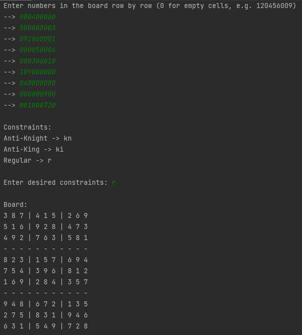

# Sudoku Solver
This is a project developed in connection with a Python Introduction course.

## Details
The solver can solve Sudoku boards using regular, Anti-Knight, or Anti-King contraints.

## How to use
1. Test it by running solver.py.
2. There is no GUI, so the numbers in the board you'd like to solve has to be entered line by line. Replace empty 
cells with 0.
3. Choose regular, anti-knight, or anti-king contraints by entering r, kn, or ki.
4. The solved board will be printed out in the console.

    An example is shown below.

    